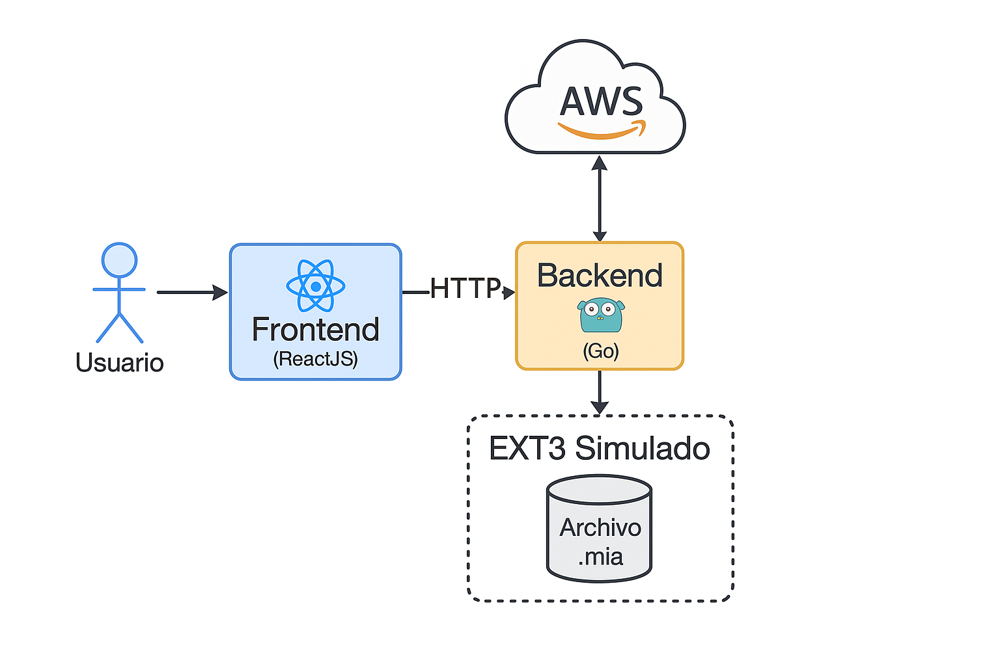
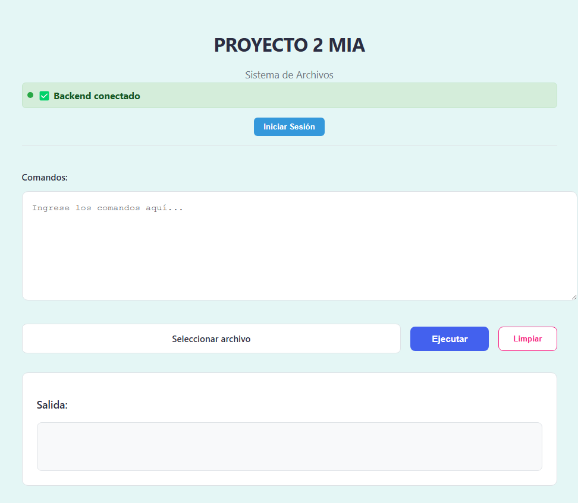

# Manual Técnico - Proyecto 2 dsk 1S 2025

## 1. Información General

**Nombre del estudiante:** Harold Alejandro sánchez Hernández
**Carné:** 202200100 
**Curso:** Manejo e Implementación de Archivos   


## 2. Descripción de la Arquitectura del Sistema

Este sistema se basa en una arquitectura cliente-servidor compuesta por los siguientes módulos, desplegados en la nube:

- **Frontend (ReactJS):** Interfaz gráfica desplegada en un bucket S3 de AWS. Permite a los usuarios enviar comandos, visualizar resultados, explorar gráficamente el sistema de archivos EXT3.
- **Backend (Go):** API RESTful desplegada en una instancia EC2 de AWS (linux amazon). Recibe comandos desde el frontend, los interpreta y ejecuta sobre archivos binarios  que simulan discos virtuales EXT3. 

Ambos componentes se comunican mediante peticiones HTTP bajo un modelo REST.

### Diagrama de Arquitectura

### Backend en Go (API REST)

Desarrollado usando el framework Fiber. Expone un endpoint `/execute` que recibe comandos JSON:

```json
{
  "command": "mkdisk -size=10"
}
```

Flujo del backend:

1. Recibe el comando vía POST.
2. Lo interpreta mediante `Analyzer`.
3. Ejecuta la acción sobre el archivo  y devuelve la respuesta al frontend.

Corre en el puerto `8080` y usa CORS para aceptar peticiones del frontend.

### Frontend en React

Frontend desplegado en S3. Permite:

- Ingresar comandos.
- Iniciar y cerrar sesión.
- Visualizar el sistema de archivos en modo gráfico (solo lectura).
- Mostrar contenido de archivos y journaling.


## 3. Explicación de las Estructuras de Datos

### MBR (Master Boot Record)
Contiene metadatos del disco, incluidas hasta 4 particiones (primarias o extendida).


### Superbloque
Metadatos del sistema EXT3: conteo de inodos, bloques, bitmaps, journaling y punteros.

### Inodos
Representan archivos/carpetas. Contienen metadatos como tipo, permisos, fechas, y punteros a bloques.

### Bloques
- Folder Blocks: referencias a carpetas.
- File Blocks: referencias a archivos.
- Content Blocks: contenido de archivos.

EXT3 usa tres tipos de bloques. Se crean el triple de bloques que de inodos.

### Bitmaps
- Bitmap de inodos: indica qué inodos están ocupados.
- Bitmap de bloques: lo mismo para bloques.


## 4. Comandos Implementados

### `mkdisk`
Crea un disco con su MBR.

### `fdisk`
Crea particiones o elimina/agrega espacio con `-add` y `-delete`.

### `mount`
Monta una partición, asignando un ID único.

### `mkfs`
Formatea la partición como EXT3 o EXT2 (por defecto). Inicializa estructuras.

### `login`
Inicia sesión en una partición con un usuario válido (`users.txt`).

### `mkdir`
Crea carpetas dentro del sistema de archivos.

### `mkfile`
Crea archivos con contenido opcional.

### `cat`
Muestra el contenido de un archivo.


### `unmount`
Desmonta una partición del sistema.


## 5. Visualización Web del Sistema de Archivos

### `mkdisk`
- **Uso:**
  ```
  mkdisk -size=10 -unit=10
  ```
- **Descripción:** Crea un disco virtual y un MBR inicial.

### `fdisk`
- **Uso:**
  ```
  fdisk -size=3 -driveletter=A -name=part1
  ```
- **Descripción:** Crea una partición primaria, extendida o lógica dentro del disco.

### `mount`
- **Uso:**
  ```
  mount -driveletter=A -name=part1
  ```
- **Descripción:** Monta una partición y le asigna un ID único en memoria.

### `mkfs`
- **Uso:**
  ```
  mkfs -id=ID -type=full -fs=3fs
  ```
- **Descripción:** Formatea la partición montada como EXT2 e inicializa superbloque, bitmaps, tablas e inodos. Crea el archivo inicial `users.txt`.

### `login`
- **Uso:**
  ```
  login -user=root -pass=123 -id=ID
  ```
- **Descripción:** Autentica usuarios con base en el archivo `users.txt`.

(Otros comandos como `mkdir`, `mkfile`, `cat`, `mkgrp`, `mkusr`, `rep`, etc., serán documentados conforme se implementen.)


## 6. Visualización Web del Sistema de Archivos

- Vista de selección de disco y partición.
- Visualizador gráfico (solo lectura) de carpetas y archivos.
- Vista de contenido de archivos `.txt`.


## 7. Despliegue en AWS

El sistema se despliega utilizando servicios de AWS para garantizar escalabilidad, disponibilidad y acceso seguro. A continuación, se detalla el proceso para el frontend (S3) y el backend (EC2), incluyendo la configuración de una instancia EC2 con Termius y el funcionamiento de un bucket S3.

Frontend (ReactJS) en Amazon S3

Pasos para el despliegue:
Construcción del frontend:
Ejecutar npm run build en el proyecto React para generar los archivos estáticos en la carpeta build.

Creación del bucket S3:

En la consola de AWS, navegar a S3 y crear un bucket con un nombre único (ej., proyecto2-dsk-frontend).
Desmarcar la opción "Block all public access" para permitir acceso público a los archivos.
Configuración para hospedaje web:
En las propiedades del bucket, habilitar Static website hosting.
Especificar index.html como documento predeterminado y, opcionalmente, un archivo de error (ej., error.html)

### Configuración de permisos:
#### Aplicar una política de bucket para permitir acceso público de lectura:

```json
{
  "Version": "2012-10-17",
  "Statement": [
    {
      "Effect": "Allow",
      "Principal": "*",
      "Action": "s3:GetObject",
      "Resource": "arn:aws:s3:::proyecto2-dsk-frontend/*"
    }
  ]
}
```


### Frontend (ReactJS)
- Construido con `npm run build`
- Subido a bucket S3 con política pública
- Configurado para servir `index.html` como página de inicio

### Backend (Go)
- Desplegado en instancia EC2 (amazon linux)
- Backend ejecutado manualmente con `go run main.go` o como servicio
- Puerto `8080` habilitado en Security Group
- Comunicación permitida desde origen cruzado (CORS)

---

